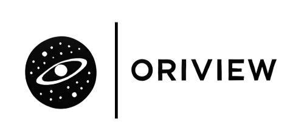
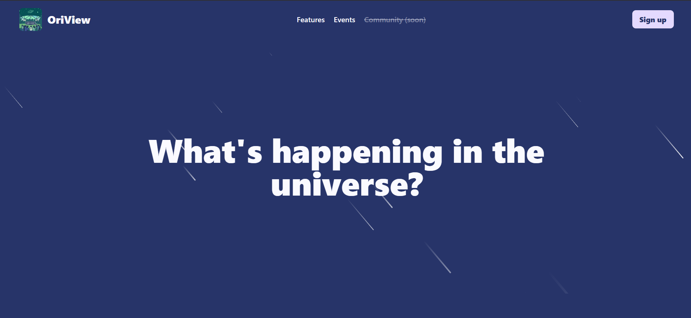

<div align="center">
 
<p>
  A platform to discover, track, and share astronomical events.
 </p>
</div>

## Screenshots


## Built with


## Getting Started
To setup the project into your local enviroment follow these steps:
1. Clone the repo
```bash
git clone https://github.com/alvaarohc/OriView.git
```
2. Navigate to the project folder
```bash
cd OriView
```
3. Install the dependencies
```bash
pnpm i
```
> You can use npm too!
4. Add your supabase project keys to the .env file
```env
NEXT_PUBLIC_SUPABASE_URL=your_public_supabase_url
NEXT_PUBLIC_SUPABASE_ANON_KEY=your_anon_key
```
5. Run the development server
```bash
pnpm dev
```
